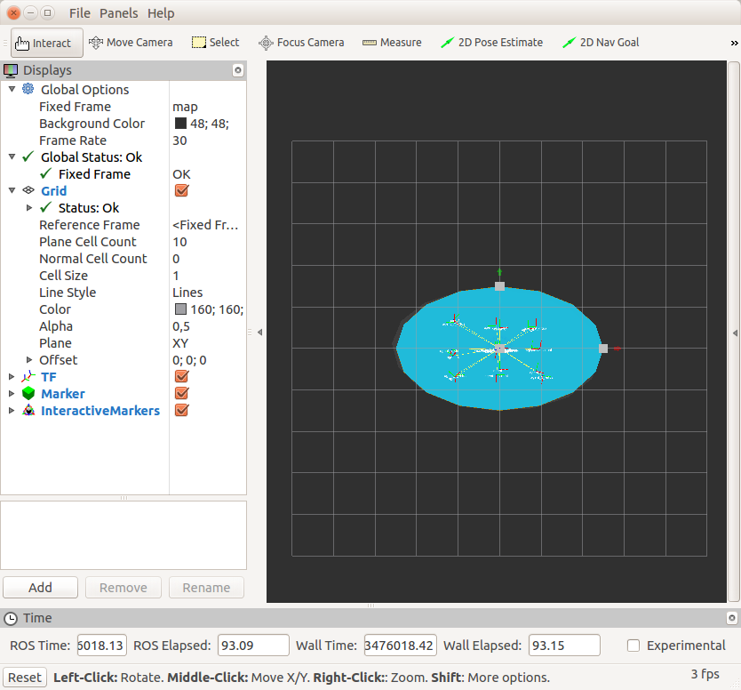
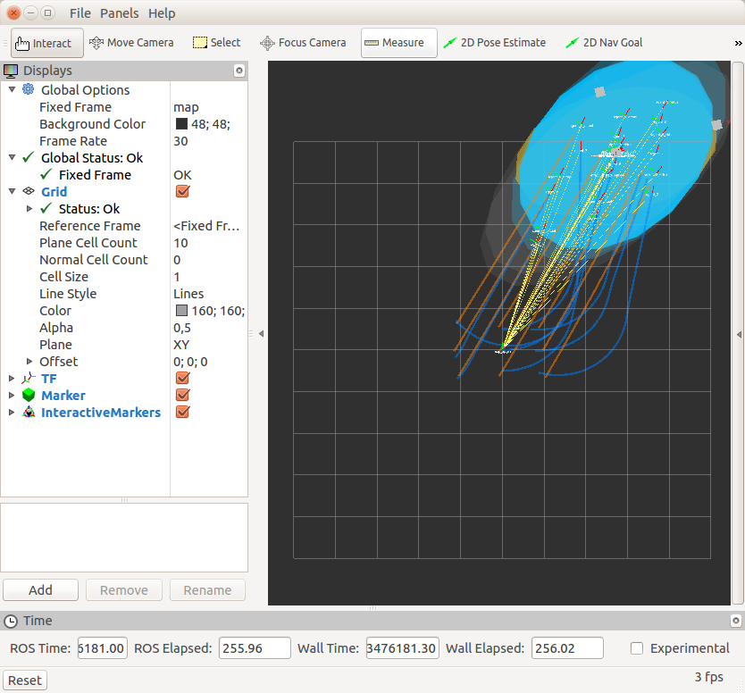

# Formation Control Algorithm
This package is the ROS implementation of the concepts exposed in [[1]](#references). The theory on which is based is well described in the paper, therefore just the practical info are reported here.

This class purpose is to provide a ROS interface which lets to simulate a multi-agent completely distribute consensus and abstraction based control algorithm.

* *multi-agent:* this algorithm works with an arbitrary number of agents `N`; given `N < N_max`, the TDMA slot `T` is such that `T = 1/(N_max + 1)` and this can be set through a ROS param (notice that this algorithm works even if each agent do not know the total number of agents connected).
* *completely distribute:* each agent shares only its estimated statistics with all the others (i.e. current position is not propagated), therefore the only things that it knows are its own pose and the estimates of all the agents connected. To share data it has been used a single common ROS topic where each agent publishes and also is subscribed to; the messages contain the id of the agent which has published it.
* *consensus based:* each virtual agent updates its estimated statistics following a consensus algorithm only on the estimates received from the others (no positions are involved directly in the computation). Notice that a guidance control is performed to let the simulated/real agents (which have a proper dynamics) to pursue their relative virtual agents (which are moved instantaneously by a specific control law proportional to the error of the estimated statistics).
* *abstraction based:* the statistics on which this algorithm is based are the first and second order momentum of the configuration of the swarm of agents, i.e. `phi(p) = [px, py, pxx, pxy, pyy]`, where `p` means the sum of the positions of all the agents in the specified direction (e.g. `pxy = sum_i(x_i * y_i)`). The statistics can be represented as an oriented ellipse in the 2D space.

Target statistics are provided to all the agents simultaneously and can be modified by interacting in rviz with 3 interactive markers attached to the target ellipse (e.g. changing the pose of its center or the length of its diameters). It has to be notice that to get satisfactory results the initial distribution of the agents has to be in the proximity of the initial target ellipse (which can be set through a ROS param).

A simple demo is shown in the four screenshots below: the first shows the initial configuration of 9 robots after few seconds of simulation (it occurs a bit of time to converge to the initial target); the others show the convergence process when the target ellipse (orange) has been moved through the interactive markers. The 9 partially overlapped blue ellipse represent the estimate statistics of each agent, which eventually converge to the target one (the convergence is reached when time tends to infinity and it is not a priori guaranteed for all the initial condition). The orange and blue lines are respectively the paths of virtual and simulated/real agents; only the simulated ones have a dynamics. Lastly, the light grey ellipses represent the effective statistics (the ones computed on the current agent poses), which not always properly converge to the target (but it certainly belong to its neighborhood). Notice that each agent (virtual, simulated or real) is identified by only its frame reference.

   

## Installation
1. clone the repository into your catkin workspace (e.g. `~/catkin_ws/src`);

        cd ~/catkin_ws/src
        git clone git@github.com:alextoind/formation-control.git

2. move to its base folder and compile the package;

        cd ~/catkin_ws
        catkin_make

It has been assumed at least a basic knowledge of the ROS environment.

## Usage
The commands reported below are just demos for this package; feel free to build your own launch file which handles your specifications (e.g. number and type of agent, initial poses, ...). Also, check the `agent_initialization.yaml` and `visualization_initialization.yaml` configuration files to select and modify common settings (the agent-specific ones has to be set in the launch file).

#### Simulation
1. from the terminal: `roslaunch formation_control demo_9_agents.launch`;
2. use the interactive markers in rviz to move the target ellipse.

#### Real Vehicles Connected
1. connect one or more vehicles to the PC;
2. from the terminal: `roslaunch formation_control demo_8_agents_and_1_real.launch`;
3. use the interactive markers in rviz to move the target ellipse.

In our case the PC is connected to a ST microcontroller which communicate through the ZigBee protocol with the vehicles (which have another ST onboard); the serialization and deserialization of the packets sent and received are demanded to the *Packet Manager* which has a ROS implementation in the PC (PacketManagerCore class) and a firmware in the microcontrollers (of both the PC and the vehicles). The Packet Manager ROS node can handle "any" number (from 1 to 9) of real agents connected and the include in the launch file remains the same (what changes is the initialization of the simulated agents).

## References
1. L. Pollini, M. Niccolini, M. Rosellini, and M. Innocenti, "Human-Swarm Interface for Abstraction Based Control," *in proceedings of the AIAA Guidance, Navigation, and Control Conference, Chicago, IL, USA,* 10–13 August 2009.

## Further Improvements
- [ ] add critical failure handler for real vehicle with problems
- [ ] visualize a communication graph of all the agents (with real vehicle could be non complete)
- [ ] add external controller for target statistic (e.g. a joystick)
- [ ] add Gazebo simulation (car URDF/SDF model + ROS control)

## Info and Warnings
- This code has been developed for ROS Indigo on ubuntu 14.04. No warranty for other distributions.